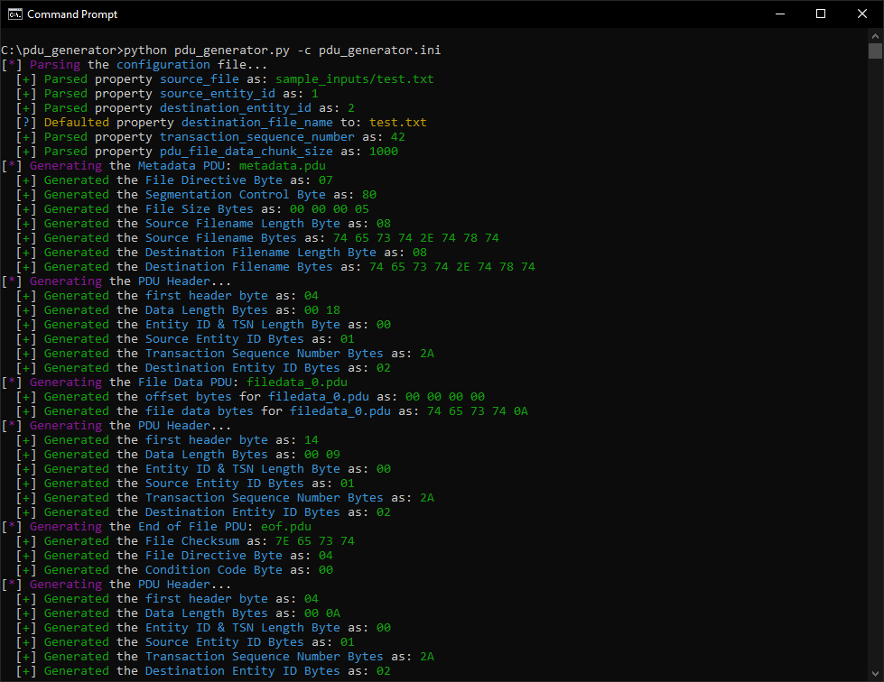

# pdu_generator.py
**Author**: James Brennan



--------
## About
This utility generates Protocol Data Units (PDUs) according to the CCSDS[^1] [727.0-B-4](https://public.ccsds.org/Pubs/727x0b4s.pdf) CFDP[^2] specification. The PDU generator is capable of producing Metadata, File Data, and End of File PDUs in order to demonstrate what data is transmitted during a CFDP **copy** operation.  

> All copy operations start with transmission of the Metadata, followed by transmission of the file segments and a PDU to indicate the End of File (EOF).[^3]

This utility is for illustration purposes only and is not intended to be a full CFDP implementation.


---------------
## Requirements
This application was implemented targeting Python 3.10+. The provided `requirements.txt` can be used to install dependency modules.
```
> pip install -r requirements.txt
```


--------
## Usage
The `pdu_generator.py` script may be run using the command below. (Note that the `-c` argument is required).
```
> python pdu_generator.py -c pdu_generator.ini
```
The script, barring errors, will produce the following types of output files:
- **metadata.pdu**: Contains the identifying information about the source file being transmitted.
- **filedata_<#>.pdu**: Contains the actual contents of the file being transmitted. Multiple filedata PDUs may be generated depending on the size of the source file and the configured `pdu_file_data_chunk_size` property.
- **eof.pdu**: Contains validation information about the source file transmitted, such as the file size and CRC.


----------------
## Configuration
The PDU generator uses the `pdu_generator.ini` configuration file to set several properties that are used when generating PDUs. Below is an example of the configuration file.
```
[CONFIG]
source_file = sample_inputs/test.txt
source_entity_id = 1
destination_entity_id = 2
#destination_file_name = test.txt
transaction_sequence_number = 42
pdu_file_data_chunk_size = 1000
```

Note that both the `[CONFIG]` section header and the `source_file` property are required. The application will assign default values for all other properties when omitted from the configuration file.

| Property                    | Explanation                                                                        | Required           | Default                    |
| --------------------------- | ---------------------------------------------------------------------------------- | ------------------ | -------------------------- |
| source_file                 | The Source (Input) File to generate PDUs for.                                      | Yes                | N/A                        |
| source_entity_id            | The Entity ID to use for the sending CFDP Processor.                               | No                 | 1                          |
| destination_entity_id       | The Entity ID to use for the receiving CFDP Processor.                             | No                 | 2                          |
| destination_file_name       | The output filename to use by the receiving CFDP Processor.                        | No                 | Base name of `source_file` |
| transaction_sequence_number | The Transaction Sequence Number (TSN) to use for all PDUs.                         | No                 | 42                         |
| pdu_file_data_chunk_size    | The maximum number of bytes from the source file to include in each File Data PDU. | No                 | 1000                       |


---------------
## How It Works
In order to provide a detailed explanation this section assumes the PDU generator has been running using the provided `pdu_generator.ini` configuration file without any changes; Upon successful execution of the application a **metadata.pdu**, **filedata_0.pdu**, and **eof.pdu** have all been produced.

### The Metadata PDU
The following output is a hexdump of the **metadata.pdu** file:
```
0000000 04 00 18 00 01 2a 02 07 80 00 00 00 05 08 74 65
0000010 73 74 2e 74 78 74 08 74 65 73 74 2e 74 78 74   
000001f
```

According to the CFDP [727.0-B-4](https://public.ccsds.org/Pubs/727x0b4s.pdf) Specification on **page 5-1** all PDUs must have a fixed-length **header**. Following the specification, the header for generated PDUs consists of the following:

| Field                                 | Length (bits) | Possible Values                                                                                                                                       | Generated Values                                                | Comments                                                          |
| ------------------------------------- | ------------- | ----------------------------------------------------------------------------------------------------------------------------------------------------- | --------------------------------------------------------------- | ----------------------------------------------------------------- |
| CFDP Version                          | 3             | 0 - Version 1 ([727.0-B-4](https://public.ccsds.org/Pubs/727x0b4s.pdf)) <br /> 1 - Version 2 ([727.0-B-5](https://public.ccsds.org/Pubs/727x0b5.pdf)) | Set to `000` for Version 1.                                     | There are currently two CFDP version, (1) and (2).                |
| PDU Type                              | 1             | 0 - File Directive <br /> 1 - File Data                                                                                                               | Determined programatically when generating PDUs.                | Varies depending on the PDU (Metadata, File Data, EOF).           |
| Direction                             | 1             | 0 - Toward Receiver <br /> 1 - Toward Sender                                                                                                          | Set to `0` for Toward Receiver.                                 | Used for PDU forwarding when value set to `1`.                    |
| Transmission Mode                     | 1             | 0 - Acknowledged <br /> 1 - Unacknowledged                                                                                                            | Set to `1` for Unacknowledged.                                  | Unacknowledged mode makes no attempt to guarantee delivery.       |
| CRC Flag                              | 1             | 0 - PDU CRC Not Present <br /> 1 - PDU CRC Present                                                                                                    | Set to `0` for PDU CRC Not Present.                             | The CRC of an individual PDU. Not the CRC of the source file.     |
| Reserved                              | 1             | 0                                                                                                                                                     | Set to `0` as this field is unused in Version 1.                | In Version 2 this field is the Large File Flag.                   |
| PDU Data Length Field                 | 16            | *                                                                                                                                                     | Determined programatically when generating PDUs.                | The Byte size of the PDU contents excluding the header.           |
| Reserved                              | 1             | 0                                                                                                                                                     | Set to `0` as this field is unused in Version 1.                | In Version 2 this field is for Segmentation Control.              |
| Length of Entity IDs                  | 3             | *                                                                                                                                                     | Determined automatically when generating PDUs.                  | The number of bytes in the Entity ID minus one.                   |
| Reserved                              | 1             | 0                                                                                                                                                     | Set to `0` as this field is unused in Version 1.                | In Version 2 this field is the Segment Metadata Flag              |
| Length of Transaction Sequence Number | 3             | *                                                                                                                                                     | Determined programatically when generating PDUs.                | The number of bytes in the Transaction Sequence Number minus one. |
| Source Entity ID                      | 8 * Length    | *                                                                                                                                                     | Set to the value of the `source_entity_id` property.            | The binary representation of the integer value.                   |
| Transaction Sequence Number           | 8 * Length    | *                                                                                                                                                     | Set to the value of the `transaction_sequence_number` property. | The binary representation of the integer value.                   |
| Destination Entity ID                 | 8 * Length    | *                                                                                                                                                     | Set to the value of the `destination_entity_id` property.       | The binary representation of the integer value.                   |

The value of the **first byte** in the generated PDU is **0x04** (0000 0100). Using the header specification table above we can match the individual bits to their definitions in the specification. Note that CFDP specification refers to the first bit in a field as "Bit 0", the following bit as "Bit 1", and so forth up to "Bit *N*-1".[^4]

| Bit # | Binary Value | Explanation                         |
| ----- | ------------ | ----------------------------------- |
| 0     | 0            | First bit of the Version number.    |
| 1     | 0            | Second bit of the Version number.   |
| 2     | 0            | Third bit of the Version number.    |
| 3     | 0            | PDU Type: File Directive PDU.       |
| 4     | 0            | Direction: Toward Receiver.         |
| 5     | 1            | Transmission Mode: Unacknowledged.  |
| 6     | 0            | PDU CRC: Not Present.               |
| 7     | 0            | Reserved: Unused in CFDP Version 1. |

The **next two bytes** represent the **PDU Data Length Field** and their values are **0x00** (0000 0000) and **0x18** (0001 1000) respectively. Together these two bytes repesent a 2-byte number with the integer value **24**. This indicates that the PDU data length size is 24 bytes long.

The **fourth byte** represents the **length** of the **Entity IDs** and **Transaction Sequence Number** and its value is **0x00** (0000 0000). Using the header specification table we can again match the individual bits to their definitions in the specification.

| Bit # | Binary Value | Explanation                                           |
| ----- | ------------ | ----------------------------------------------------- |
| 0     | 0            | Reserved: Unused in CFDP Version 1.                   |
| 1     | 0            | First bit of the Entity ID length.                    |
| 2     | 0            | Second bit of the Entity ID length.                   |
| 3     | 0            | Third bit of the Entity ID length.                    |
| 4     | 0            | Reserved: Unused in CFDP version 1.                   |
| 5     | 1            | First bit of the Transaction Sequence Number length.  |
| 6     | 0            | Second bit of the Transaction Sequence Number length. |
| 7     | 0            | Third bit of the Transaction Sequence Number length.  |

The **fifth byte** represents the **Source Entity ID** and its value is **0x01** (0000 0001) which has an integer value of **1**. This indicates the Source Entity ID is 1. This field is only 1-byte long as specified by the **Length of Entity IDs** field.

The **sixth byte** represents the **Transaction Sequence Number** and its value is **0x2A** (0010 1010) which has an integer value of **42**. This indicates the Transaction Sequence Number is 42. This field is only 1-byte long as specified by the **Length of Transaction Sequence Number** field.

The **seventh byte** represents the **Destination Entity ID** and its value is **0x02** (0000 0010) which has an integer value of **2**. This indicates the Destination Entity ID is 2. This field is only 1-byte long as specified by the **Length of Entity IDs** field.

Following the header bytes, the **eigth** byte represents the **File Directive Code** and its value is **0x07** (0000 0111). This indicates the PDU is a **Metadata PDU**. The table below contains the File Directive Codes defined in the CFDP [727.0-B-4](https://public.ccsds.org/Pubs/727x0b4s.pdf) Specification on **page 5-4**.

| File Directive Code (Hex) | Directive      |
| ------------------------- | -------------- |
| 00                        | Reserved       |
| 01                        | Reserved       |
| 02                        | Reserved       |
| 03                        | Reserved       |
| 04                        | EOF PDU        |
| 05                        | Finished PDU   |
| 06                        | ACK PDU        |
| 07                        | Metadata PDU   |
| 08                        | NAK PDU        |
| 09                        | Prompt PDU     |
| 0C                        | Keep Alive PDU |    
| 0D - FF                   | Reserved       |

The **remaining 23 bytes** contain the **Metadata PDU Contents**. The table below contains the Metadata PDU Contents defined in the CFDP [727.0-B-4](https://public.ccsds.org/Pubs/727x0b4s.pdf) Specification on **page 5-10**.

| Field                        | Length (bits) | Possible Values                                                           | Generated Values                                                  | Comments                                                                                                            |
| ---------------------------- | ------------- | ------------------------------------------------------------------------- | ----------------------------------------------------------------- | ------------------------------------------------------------------------------------------------------------------- |
| Segmentation Control         | 1             | 0 - Respect Record Boundaries <br /> 1 - Do Not Respect Record Boundaries | Set to `1` for Do Not Respect Record Boundaries.                  | Indicates whether or not the file contains records whose boundaries are to be respected when the file is segmented. |
| Reserved                     | 7             | 0                                                                         | Set to `0` as this field is unused in Version 1.                  | In Version 2 this field is the Closure Requested Flag.                                                              |
| Source File Size             | 32            | *                                                                         | Set to the size of the `source_file` in bytes.                    | The binary representation of the integer value.                                                                     |
| Source File Name Length      | 8             | 0 to 255                                                                  | Set to the length of the base name of the `source_file` property. | The binary representation of the integer value.                                                                     |
| Source File Name             | 8 * Length    | *                                                                         | Set to the value of the base name the `source_file` property.     | The binary representation of the string value (ASCII encoded).                                                      |       
| Destination File Name Length | 8             | 0 to 255                                                                  | Set to the length of the `destination_file_name` property.        | The binary representation of the integer value.                                                                     |
| Destination File Name        | 8 * Length    | *                                                                         | Set to the value of the `destination_file_name` property.         | The binary representation of the string value (ASCII encoded).                                                      |

The **first byte** of the 23 remaining bytes represents the **Segementation Control** and its value is **0x80** (1000 0000). Bit 0 has a value of **1** indicating to Not Respect Record Bounaries. The remaining bits are unused and ignored.

The **next four** bytes represent the **Source File Size** (in bytes) and their values are **0x00** (0000 0000), **0x00** (0000 0000), **0x00** (0000 0000), and **0x05** (0000 0101) respectively. Together these four bytes represent a 4-byte number with the integer value **5**. This indicates that the `source_file` is 5 bytes in size.

The **next byte** is the **Source File Name Length** (in bytes) and its value is **0x08** (0000 1000) which has an integer value of **8**. This indicates the base name of the `source_file` is 8 bytes long when encoded using ASCII.

The **next eight bytes** represent the **Source File Name**, where each byte represents the ASCII encoded value of a character. Their values are **0x74** (0111 0100) [**t**], **0x65** (0110 0101) [**e**], **0x73** (0111 0011) [**s**], **0x74** (0111 0100) [**t**], **0x2E** (0010 1110) [**.**], **0x74** (0111 0100) [**t**], **0x78** (0111 1000) [**x**], **0x74** (0111 0100) [**t**] respectively.

The **next byte** is the **Destination File Name Length** (in bytes) and its value is **0x08** (0000 1000) which has an integer value of **8**. This indicates the `destination_file_name` is 8 bytes long when encoded using ASCII.

The **next eight bytes** represent the **Destination File Name**, where each byte represents the ASCII encoded value of a character. Their values are **0x74** (0111 0100) [**t**], **0x65** (0110 0101) [**e**], **0x73** (0111 0011) [**s**], **0x74** (0111 0100) [**t**], **0x2E** (0010 1110) [**.**], **0x74** (0111 0100) [**t**], **0x78** (0111 1000) [**x**], **0x74** (0111 0100) [**t**] respectively.


### The File Data PDU
The following output is a hexdump of the **filedata_0.pdu** file. Since the size of the `source_file` was smaller than the `pdu_file_data_chunk_size` only one filedata PDU was generated.
```
0000000 14 00 09 00 01 2a 02 00 00 00 00 74 65 73 74 0a
0000010
```

Of the fixed-length **header**, the value of the **first byte** in the generated PDU is **0x14** (0001 0100). Using the header specification table we can match the individual bits to their definitions in the specification.

| Bit # | Binary Value | Explanation                         |
| ----- | ------------ | ----------------------------------- |
| 0     | 0            | First bit of the Version number.    |
| 1     | 0            | Second bit of the Version number.   |
| 2     | 0            | Third bit of the Version number.    |
| 3     | 1            | PDU Type: File Data PDU.            |
| 4     | 0            | Direction: Toward Receiver.         |
| 5     | 1            | Transmission Mode: Unacknowledged.  |
| 6     | 0            | PDU CRC: Not Present.               |
| 7     | 0            | Reserved: Unused in CFDP Version 1. |

The **next two bytes** represent the **PDU Data Length Field** and their values are **0x00** (0000 0000) and **0x09** (0000 1001) respectively. Together these two bytes repesent a 2-byte number with the integer value **9**. This indicates that the PDU data length size is 9 bytes long.

The additional bytes in the **header** are the same as in the **Metadata PDU** and are skipped for brevity. The **remaining nine bytes** contain the **File Data PDU Contents**. The table below contains the File Data PDU Contents defined in the CFDP [727.0-B-4](https://public.ccsds.org/Pubs/727x0b4s.pdf) Specification on **page 5-12**.

| Field     | Length (bits) | Possible Values (hex) | Generated Values               | Comments                                                             |
| --------- | ------------- | --------------------- | ------------------------------ | -------------------------------------------------------------------- |
| Offset    | 32            | 00000000 to FFFFFFFF  | The file data offset in bytes. | The binary representation of the integer value.                      |
| File Data | variable      | *                     | The file data.                 | The size of this field is limited by the `pdu_file_data_chunk_size`. |

The **offset bytes** are **0x00** (0000 0000), **0x00** (0000 0000), **0x00** (0000 0000), and **0x00** (0000 0000) respectively. Together these four bytes represent a 4-byte number with the integer value **0**. This indicates that there is an offset of 0 bytes.

The **file data bytes** are the contents of the source file and have the values **0x74** (0111 0100) [**t**], **0x65** (0110 0101) [**e**], **0x73** (0111 0011) [**s**], **0x74** (0111 0100) [**t**], **0x0A** (0000 1010) [**\n**] respectively.


### The End of File PDU
The following output is a hexdump of the **eof.pdu** file.
```
0000000 04 00 0a 00 01 2a 02 04 00 7e 65 73 74 00 00 00
0000010 05                                             
0000011
```

Of the fixed-length **header**, the value of the **first byte** in the generated PDU is **0x04** (0000 0100). Using the header specification table we can match the individual bits to their definitions in the specification.

| Bit # | Binary Value | Explanation                         |
| ----- | ------------ | ----------------------------------- |
| 0     | 0            | First bit of the Version number.    |
| 1     | 0            | Second bit of the Version number.   |
| 2     | 0            | Third bit of the Version number.    |
| 3     | 0            | PDU Type: File Directive PDU.       |
| 4     | 0            | Direction: Toward Receiver.         |
| 5     | 1            | Transmission Mode: Unacknowledged.  |
| 6     | 0            | PDU CRC: Not Present.               |
| 7     | 0            | Reserved: Unused in CFDP Version 1. |

The **next two bytes** represent the **PDU Data Length Field** and their values are **0x00** (0000 0000) and **0x0A** (0000 1010) respectively. Together these two bytes repesent a 2-byte number with the integer value **10**. This indicates that the PDU data length size is 10 bytes long.

The additional bytes in the **header** are the same as in the **Metadata PDU** and are skipped for brevity.

Following the header bytes, the **eigth** byte represents the **File Directive Code** and its value is **0x04** (0000 0100). This indicates the PDU is a **End of File PDU**. 

The **remaining nine bytes** contain the **End of File PDU Contents**. The table below contains the Metadata PDU Contents defined in the CFDP [727.0-B-4](https://public.ccsds.org/Pubs/727x0b4s.pdf) Specification on **page 5-6**.

| Field          | Length (bits) | Possible Values                                            | Generated Values                                 | Comments                                             |
| -------------- | ------------- | ---------------------------------------------------------- | ------------------------------------------------ | ---------------------------------------------------- |
| Condition Code | 4             | 0000 - No Error <br /> See specification for other values. | Set to `0` for No Error.                         | Indicates the overall status of the transaction.     |
| Spare          | 4             | 0                                                          | Set to `0` as this field is unused in Version 1. | Unused in both Version 1 and Version 2 of CFDP.      |
| File Checksum  | 32            | *                                                          | Determined programatically when generating PDU.  | Calculated using the modular checksum[^5] algorithm. |
| File Size      | 32            | *                                                          | Set to the size of the `source_file` in bytes.   | The binary representation of the integer value.      |


The **first** byte of the remaining 9 bytes represents the **Condition Code** and **Spare** fields and its value is **0x00** (0000 0000). The first four bits indicate the Condition Code is No Error. The remaining bits are unused and ignored.

The **next four bytes** represent the **File Checksum** and their values are **0x7E** (0111 1110), **0x65** (0110 0101), **0x73** (0111 0011), and **74** (0111 0100) respectively. Together these four bytes represent the calculated modular checksum[^5] of the `source_file`.

The **remaining four bytes** represent the **File Size** and their values are **0x00** (0000 0000), **0x00** (0000 0000), **0x00** (0000 0000), **0x05** (0000 0101) respectively. Together these four bytes represent a 4-byte number with the integer value **5**. This indicates that the total file data is 5 bytes long. 


-----------------------
## Wireshark
The generated PDUs may be viewed in [Wireshark](https://www.wireshark.org) using its internal CFDP packet dissector. In order to view the PDUs in Wireshark you must first create a hexdump of them. 

### Hexdumping the PDUs
The hexdump examples provided above were generated running the following command on Linux for each PDU file:
```
> hexdump -v metadata.pdu > metadata.hex
```

Alternatively, on Windows, you may run the following command in Powershell:
```
> CertUtil -encodehex metadata.pdu metadata.hex
```

### Configuring Wireshark
Wireshark by default will be unable to properly interpret the PDUs as they are not enclosed within a packet (for example, a [CCSDS Space Packet](https://public.ccsds.org/Pubs/133x0b2e1.pdf)). It is possible however to configure Wireshark so that it will parse the PDUs as payloads for the `DLT_User` protocol. This approach has been taken from the [How To Dissect Anything Wireshark Tutorial](https://wiki.wireshark.org/HowToDissectAnything).

In Wireshark go to **Preferences** and expand the **Protocols** dropdown. Find the `DLT_User` entry and click the **Edit** button for Encapsulations Table. Click the **+** button to add a new entry and configure it as follows:

| DLT              | Payload protocol | Header size | Header protocol | Trailier size | Trailer protocol |
| ---------------- | ---------------- | ----------- | --------------- | ------------- | ---------------- |
| User 0 (DLT=147) | cfdp             | 0           |                 | 0             |                  |

### Viewing in Wireshark
After making the above configuration changes go to **File** and select **Import from Hex Dump**. Select the hexdump file of the PDU you wish to inspect and ensure the **Offsets** option is set to Hexadecimal. In the **Encapsulation** set the **Encapsulation Type** to `USER_0`. Click **Import**. Below is a screenshot of Wireshark dissecting the `metadata.pdu` hexdump for reference.


[^1]: [Consultative Committe for Space Data Systems](https://public.ccsds.org)
[^2]: CCSDS File Delivery Protocol
[^3]: CCSDS Publication [727.0-B-4](https://public.ccsds.org/Pubs/727x0b4s.pdf), pg. 2-9
[^4]: CCSDS Publication [727.0-B-4](https://public.ccsds.org/Pubs/727x0b4s.pdf), pg. 1-1
[^5]: CCSDS Publication [727.0-B-4](https://public.ccsds.org/Pubs/727x0b4s.pdf), pg. C-1.